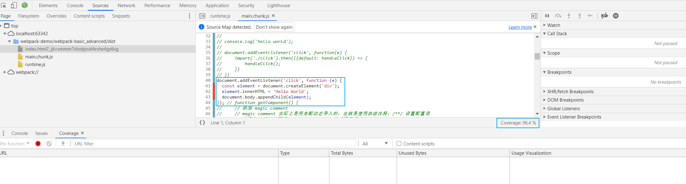

# 懒加载（lazy-loading）与 配置 preloading 和 prefetching

## 1. 背景

1. 懒加载是前端页面优化的一种方式。懒加载指的是不会提前加载 js 代码或者某种资源，等到需要的时候再加载。初始化页面时，不需要的资源可以不用加载，等需要的时候再动态加载，这样可以提高页面的加载速度。

2. preloading 或者 prefetching ，指的是预加载，也就是提前请求一些资源，这样等需要的时候，就能直接使用，无需请求，节约了时间，提高了效率。

## 1. 懒加载（lazy-loading）

1. 在 index.js 中添加如下的代码：
   ```javascript
      function getComponent() {
          // 添加 magic comment
          // magic comment 实际上是用来配动态导入的，也就是使用块级注释：/**/ 设置配置项
          // 在导入的模块前面添加 magic comment，然后配置项就会生效
          // 将打包后的 lodash 模块命名为 lodash，而不是 0.js
          return import(/*webpackChunkName:"lodash"*/ 'lodash').then(({default: _}) => {
              const element = document.createElement('div');
              element.innerHTML = _.join([1, 2, 3, 4, 5], '*');
              return element;
          })
      }
      document.addEventListener('click', function (e) {
          getComponent().then(element => {
              document.body.appendChild(element);
          })
      })
   ```
   页面刚刚加载的时候，不加载 `lodash`，当我们点击页面的时候，调用 import() 函数动态导入 `lodash`。这样就实现了懒加载。

2. 动态导入函数 import() 的说明：
   - 标准用法的import导入的模块是静态的，会使所有被导入的模块，在加载时就被编译（无法做到按需编译，降低首页加载速度）。有些场景中，你可能希望根据条件导入模块或者按需导入模块，这时你可以使用动态导入代替静态导入。下面的是你可能会需要动态导入的场景：
     - 当静态导入的模块很明显的降低了代码的加载速度且被使用的可能性很低，或者并不需要马上使用它。
     - 当静态导入的模块很明显的占用了大量系统内存且被使用的可能性很低。
     - 当被导入的模块，在加载时并不存在，需要异步获取。
     - 当导入模块的说明符，需要动态构建。（静态导入只能使用静态说明符）
     - 当被导入的模块有副作用（这里说的副作用，可以理解为模块中会直接运行的代码），这些副作用只有在触发了某些条件才被需要时。（原则上来说，模块不能有副作用，但是很多时候，你无法控制你所依赖的模块的内容）
   - 请不要滥用动态导入（只有在必要情况下采用）。静态框架能更好的初始化依赖，而且更有利于静态分析工具和tree shaking发挥作用。
   - import() 函数返回一个 Promise 结果，因此可以使用 then() 链式调用。
   - import() 属于较新的语法，因此，我们在使用的时候，需要引入 `@babel/polyfill`，以保证兼容性。
   - 由于 import() 函数返回一个 Promise 结果，所以我们可以使用 async/await，将其改写为同步代码的形式。
   
## 2. preloading 和 prefetching（预加载）

1. 当我们引入第三方模块的时候，webpack 会将其打包。在加载页面的时候，浏览器会去请求这些打包后的第三方模块。当浏览器第二次或者第三次请求时，由于第三方模块没有发生变化，那么不用请求这些文件，直接使用缓存即可。

2. 通过上面的描述，我们可以得知，只有第二次即以后的请求才会使用缓存。实际上，我们希望的时尽量提搞第一次加载的速度。

3. 在 index.js 添加如下的代码：
   ```javascript
      // index.js
      document.addEventListener('click', function(e) {
          const element = document.createElement('div');
          element.innerHTML = 'hello world';
          document.body.append(element);
      })
   ```

3. 打开浏览器的调试窗口，在 console 下，按下快捷键：ctrl + shift + p，在弹出的界面输入：coverage。点击录制按钮，就会出现我们的 js 代码的一个利用率：如下图所示：

利用率是 96.4%，这是因为下面的这一部分代码并没有执行，因为只有点击事件发生，才会执行下面的代码。因此在首页加载的时候，加载了一定的“无用”代码，会浪费一定的浏览器执行性能。
   ```javascript
      const element = document.createElement('div');
      element.innerHTML = 'hello world';
      document.body.append(element);
   ```
4. 怎么解决这个问题呢，答案是我们将不需要在首页执行的逻辑放到一个单独的模块中，通过 import() 函数，在需要的时候动态导入。

5. 我们将点击事件的处理函数放到一个单独的模块：`click.js`，具体内容如下所示：
   ```javascript
      function handleClick(e) {
          const element = document.createElement('div');
          element.innerHTML = 'hello world';
          document.body.append(element);
      }
      
      export default handleClick;
   ```

6. 那么 index.js 我们也要进行修改：
   ```javascript
      document.addEventListener('click', function(e) {
          import('./click').then(({default: handleClick}) => {
              handleClick();
          })      
      })
   ```
   在点击事件发生的时候，我们再去动态加载 `click.js`。无用的代码少了，就提高了代码的利用率。

7. prefetching 和 preloading
   - 当前页面的需要动态引入一些模块，在页面加载的时候不需要，但是当我们触发一些事件的时候需要这些模块。比如说，点击登录按钮，会弹出一个登录的模态框。实际上，加载首页时，不需要将模态框的代码加载。等点击登录按钮时，再加载这部分的代码。但是这样现加载有可能由于网络延迟等问题导致加载过慢。所以为了解决这个问题，webpack 提供了两个 magic comment：prefetch 和 preload。
   - 参考资料：[Prefetching/Preloading modules
](https://v4.webpack.js.org/guides/code-splitting/#prefetchingpreloading-modules)
   - 示例：
     ```javascript
        document.addEventListener('click', function(e) {
            // 设置 webpackPrefetch 为 true，表示核心 js 加载完成以后，等待带宽空闲了再去加载可能用到的其他模块
            // webpackPreload 用法和 webpackPrefetch 类似
            // 使用多个 magic comment，即在不同行，写多个 /* ... */ 即可
            import(/* webpackPrefetch: true */
                   /* webpackChunkName:"click" */
     './click').then(({default: handleClick}) => {
                  handleClick();
            })      
        })
     ```
   - prefetch 与 preload 的区别
     - preload 是与核心需求的 js 文件一起加载，而 prefetch 则是表示核心 js 加载完成以后，等待带宽空闲了再去加载可能用到的其他模块。
     - 设置为 preload 的模块的优先级为中，并且会被立即下载，而设置为 prefetch 的模块会等到浏览器空闲后再去下载。
     - 父模块（parent chunk）应立即请求设置为 preload 的模块。而设置为 prefetch 的模块可以在将来的任何时候使用。
     - prefetch 的浏览器兼容性更好。
   - 推荐使用 prefetch。
   
8. 总结
   - **在书写高质量的前端代码时，要更加关注的是代码的利用率，而不是缓存**。
   - 多些异步逻辑，将首页加载不需要的内容放到单独的模块中，需要的时候再加载。
   - 交互事件的处理逻辑放到异步加载的模块中，事件发生时再加载。
   - webpack 默认对异步加载的模块进行打包，不打包同步的代码。这样可以提升打包性能，提高首页的加载速度。
   - 在动态引入模块时，magic comment 提供的预加载功能，推荐使用 prefetch，而不是 preload。