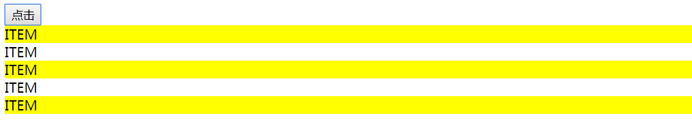
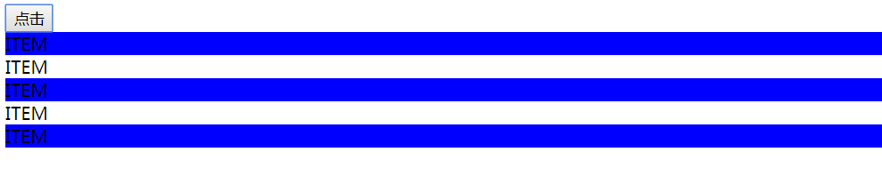

<!-- START doctoc generated TOC please keep comment here to allow auto update -->
<!-- DON'T EDIT THIS SECTION, INSTEAD RE-RUN doctoc TO UPDATE -->
**Table of Contents**  *generated with [DocToc](https://github.com/thlorenz/doctoc)*

- [热模块替换（Hot Module Replacement，HMR）](#%E7%83%AD%E6%A8%A1%E5%9D%97%E6%9B%BF%E6%8D%A2hot-module-replacementhmr)
  - [1. 概念](#1-%E6%A6%82%E5%BF%B5)
  - [2. 使用 - CSS](#2-%E4%BD%BF%E7%94%A8---css)
  - [3. 使用 - JavaScript](#3-%E4%BD%BF%E7%94%A8---javascript)
  - [4. 总结](#4-%E6%80%BB%E7%BB%93)

<!-- END doctoc generated TOC please keep comment here to allow auto update -->

# 热模块替换（Hot Module Replacement，HMR）


## 1. 概念

1. 热模块替换（Hot Module Replacement，HMR），指的是在不影响其他模块功能的情况下（或者在运行的时候），更新其他模块的功能。两者之间不会相互影响。

## 2. 使用 - CSS

1. 举个例子：

   ```javascript
      index.js
      var contentHTML = `
          <div class="buttonContainer">
              <button id="btn">点击</button>
          </div>
      ` ;
      
      var body = document.querySelector('body') ;
      
      body.insertAdjacentHTML('beforeend', contentHTML) ;
      
      var button = document.querySelector("#btn") ;
      
      button.addEventListener('click', function(e) {
      
          var div = document.querySelector('.buttonContainer') ;
          console.log(div) ;
          div.insertAdjacentHTML('beforeend', `<div>ITEM</div>`) ;
      })
   ```

2. 这段 js 代码的作用是向页面中插入一个 button 元素，并给 button 绑定事件。点击 button，页面中会出现 item。

3. 给新添加的 item 增加了样式：
   ```css
      style.css
      .buttonContainer div:nth-of-type(odd) {
          /*
          选中奇数个div元素
         */
          background: yellow;
      }
   ```
4. 给奇数个 item 设置背景颜色。如下图所示：
   

5. 如果我想改变背景颜色，比如：
   ```css
      .buttonContainer div:nth-of-type(odd) {
          /*
          选中奇数个div元素
         */
          background: blue;
      }
   ```

6. 由于我启用了 webpack-dev-server，那么会监测文件变化，自动打包，刷新浏览器。我们看到的是这样：
   
   页面被刷新，我们必须点击按钮，才会出现更改后的效果：
   

7. 我们想在不刷新页面的情况下，就看到效果，怎么办呢？
答案是：对 webpack-dev-server 进行配置。配置如下：
   ```javascript
      webpack.config.js
      var webpack = require('webpack') ;
      module.exports = {
          // 配置webpack-dev-server
          // webpack提供的一个http服务
          devServer: {
              // 设置服务器的根路径
              // 所有的文件以及目录都必须放在这个根路径下，服务器才可以访问到
              contentBase: './dist',
              // 第一次启动时，自动打开浏览器
              open: true,
              // 配置端口，默认是8080
              port: 8080,
              // hot属性设置为true，表示开启Hot Module Replacement(HMR)
              hot: true,
              // hotOnly设置为true，表示即使HMR功能失效，浏览器也不会自动刷新
              hotOnly: true
          },
      plugins: [
              new webpack.HotModuleReplacementPlugin()
          ],
      }
   ```

8. 主要配置两个方面：
   - `devServer` 增加两个属性 `hot` 和 `hotOnly`。
     - `hot` 属性设置为 `true`，表示开启 Hot Module Replacement(HMR)。
     - `hotOnly` 设置为 `true`，表示即使 HMR 功能失效，浏览器也不会自动刷新。
   - plugins
     - 首先引入 webpack 模块：
`var webpack = require('webpack');`
     - 然后 `plugins` 属性中添加：
`new webpack.HotModuleReplacementPlugin()`
     - 完整形式：
`plugins: [
        new webpack.HotModuleReplacementPlugin()
    ],`  
这样就实现CSS样式的HMR。


## 3. 使用 - JavaScript

1. 新建两个 js 文件，counter.js 和 number.js，代码如下：
    ```javascript
       counter.js
       export default function counter() {
           var html = `<div id="counter">1</div>` ;
           document.body.insertAdjacentHTML('beforeend', html) ;
       
           var div = document.querySelector('#counter') ;
       
           div.addEventListener('click', function () {
               var num = div.innerHTML ;
               div.innerHTML = parseInt(num, 10) + 1 ;
           })
       }
    ```
    点击数字，实现数字加1。
    ```javascript
       numbers.js
       export default function number() {
       
           var html = `<div id="number">8000</div>` ;
           var div = document.querySelector('#number') ;
       
           // 保证页面只有一个div#number
           if (div) {
               div.parentElement.removeChild(div) ;
           }
       
           document.body.insertAdjacentHTML('beforeend', html) ;
       }
    ```
    在页面中插入一个数字。
2. 在 index.js 中引入，并执行：
    ```javascript
       index.js
       import counter from './counter'
       import number from './numbers'
       
       counter() ;
       number() ;
    ```

3. 我们希望对于 numbers 模块的修改，不会影响counter。如下图所示：
      
    counter 模块控制的 7，不会因为更改了 number 模块而导致的页面刷新回到初始状态。

4. 我们需要在 index.js 中添加如下代码：
    ```javascript
       // 启用了HMR
       if (module.hot) {
           // 第一个参数是依赖项，也就是要监视哪个文件
           // 第二个参数是回调函数，表示监视的文件一旦发生变化，就执行回调函数
           module.hot.accept('./numbers', () => {
               number() ;
           })
       }
    ```
    首先检测是否启用 HMR。然后调用 accept() 函数，监视 numbers 模块的变化。一旦 numbers 模块发生变化，就调用回调函数。这样就是实现了 js 文件的 HMR。

## 4. 总结

1. 启用 HMR
   - 在 `devServer` 中，配置 `hot` 和 `hotOnly` 这两个字段。
   - 配置 `HotModuleReplacementPlugin` 插件
     ```javascript
        const webpack = require('webpack');
        module.exports = {
            plugins: [
                new webpack.HotModuleReplacementPlugin()
            ], 
        }
        
     ```
2. 通过配置启用 HMR 以后，对 CSS 文件是默认生效的。因为在 `css-loader` 已经替我们做过配置了。

3. 对于 js 文件，需要我们手动去监听 js 文件：
   ```javascript
      if (module.hot) {
          // 第一个参数是依赖项，也就是要监视哪个文件
          // 第二个参数是回调函数，表示监视的文件一旦发生变化，就执行回调函数
          module.hot.accept('./numbers', () => {
               number() ;
          })
      }
   ``` 