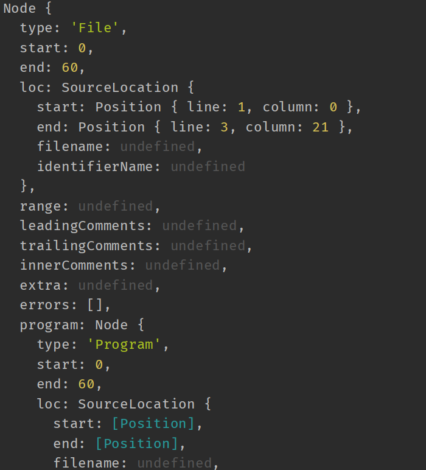

# 自定义 bundler

## 1. 分析依赖

1. 模块打包器的一个作用就是从入口文件开始，分析出每个模块与其他模块的一个依赖关系，得到依赖关系以后，再进行代码的编译。

2. 在 src 目录下，新建 `index.js`、`message.js` 和 `word.js` 这三个文件，内容如下：
   - `index.js`
     ```javascript
        import message from './message.js';
        console.log(message);
     ```
   - `message.js`
      ```javascript
         import {word} from './word.js';
         
         const message = `say ${word}`;
         
         export default message;
      ```
   - `word.js`
     ```javascript
        export const word = 'word';
     ```
3. `index.js` 引入了 `message.js`， `message.js` 引入了 `word.js`，简便起见，我们给每个导入的模块加了后缀。

4. 新建一个 `bundler.js`，这个 js 文件就是用来打包的。我们要在这个文件中完成三件事：
   - 分析依赖
   - 生成依赖图谱
   - 编译为浏览器可执行的代码

5. 首先进行的分析依赖。在 `bundler.js` 中，新建一个函数：`moduleAnalyser()`，内容如下：
   ```javascript
      const fs = require('fs');
      const path = require('path');
      const parser = require('@babel/parser');
   
      const traverse = require('@babel/traverse').default;
      // import traverse from '@babel/traverse';
   
      const babel = require('@babel/core');
   
      const moduleAnalyser = (filename) => {
         const content = fs.readFileSync(filename, 'utf-8');
   
         const ast = parser.parse(content, {
             sourceType: 'module',
         });
         const dependencies = {};
         traverse(ast, {
             ImportDeclaration({node}) {
                 const dirname = path.dirname(filename);
                 
                 const newFile = path.join(dirname, node.source.value);
   
                 dependencies[node.source.value] = newFile;
             }
         });
   
         const {code} = babel.transformFromAst(ast, null, {
             presets: ['@babel/preset-env']
         });
   
         return {
              filename,
              dependencies,
              code
         }
         
      }
   ```

6. 使用 `fs.readFileSync()` 同步读取 `filename` 指定的文件内容，并指定了文件的编码为 `utf-8`。

7. 获取了 js 文件的源码后，我们需要分析出引入了哪些模块。所以我们能这里使用 `@babel/parser` 对 js 源码进行解析，将其转换为 AST （abstract syntax code）。
   - `@babel/parser` 是用来解析 js 代码的 babel 插件。
   - 安装：`npm install @babel/parser --save`
   - 我们使用 `parser()` 方法完成对 js 代码的解析。接收两个参数：
     - code：必填，字符串形式的 js 源代码
     - options：可选，配置项，我们这里的配置项是 `sourceType`，表示解析代码的模式。因为我们的源代码中使用了 ES Module 形式引入其他模块，所以 `sourceType` 设置为 `module`。还可以设置为 `script` 或者是 `unambiguous`。
       > Indicate the mode the code should be parsed in. Can be one of "script", "module", or "unambiguous". Defaults to "script". "unambiguous" will make @babel/parser attempt to guess, based on the presence of ES6 import or export statements. Files with ES6 imports and exports are considered "module" and are otherwise "script".
   - `@babel/parser` 详细的说明文档：[@babel/parser](https://babeljs.io/docs/en/babel-parser#docsNav)
   
8. 将 index.js 内的源码转换为 AST，部分内容被如下：
   

9. 在源码的 AST 中，我们需要获取 `ImportDeclaration` 这个节点，因为这个节点存放这我们导入的文件的相关信息。而 AST 实际上是一个大的对象，我们自己手动前去遍历这个对象不方便，而且效率不高，因此我们使用另外一个 babel 插件 —— `@babel/traverse`，完成对 AST 的遍历。
   - `@babel/traverse`
   - 安装：`npm install @babel/traverse ---save`
   - 主要作用是将其与 babel 解析器一起使用来遍历和更新节点。
     - 对语法树中特定的节点进行操作(特殊节点的函数)
     - 进入节点（enter）
     - 退出节点（exit）
   - traverse() 是默认导出，所以使用 ES6 语法导入：`import traverse from "@babel/traverse";` 
   - 如果使用 CommonJS 方式导入，就需要导出 `default`，即 `const traverse = require('@babel/traverse').default;`
   - traverse() 接收的第一个参数是 AST，第二个参数是配置项对象，我们可以在配置项中定义函数，函数名就是我们要获取的那个节点，函数接收的参数就是这个节点相关的内容，我们目前只需要节点中的 `node` 字段，所以直接从参数中取即可，示例如下所示：
     ```javascript
        traverse(ast, {
          CallExpression(p) {
            // 对语法树中特定的节点进行操作 参考@babel/types （特定节点类型）
            // CallExpression 特定节点
          },
          FunctionDeclaration: function(path) {
            // 对语法树中特定的节点进行操作 参考@babel/types （特定节点类型）
            // FunctionDeclaration 特定节点
          }
          // .....
        
          enter(path) {
            // 进入节点
            if (path.node.type === "ThisExpression") {
              // 对所有的操作
            };
          }
          exit(path) {
            // 退出节点
            console.log(`  exit ${path.type}(${path.key})`)
          }
        })
     ```
     我们在配置项中使用的是第一种：
     ```javascript
        const traverse = require('@babel/traverse').default;
        traverse(ast, {
            // 节点名称
            ImportDeclaration({node}) {
                // do something with variable node
     
                const dirname = path.dirname(filename);
                                 
                const newFile = path.join(dirname, node.source.value);
                   
                dependencies[node.source.value] = newFile;
            }
        });
     ```
   - `node.source.value` 这个值，实际上是我们导入模块的一个相对路径，由于这个路径是相对于当前的 js 文件而言的，所以我们需要将相对路径转换为绝对路径：`const newFile = path.join(dirname, node.source.value);`
## 2. 生成依赖图谱 （dependencies graph）

## 3. 编译为浏览器可执行的代码

## 4. 总结