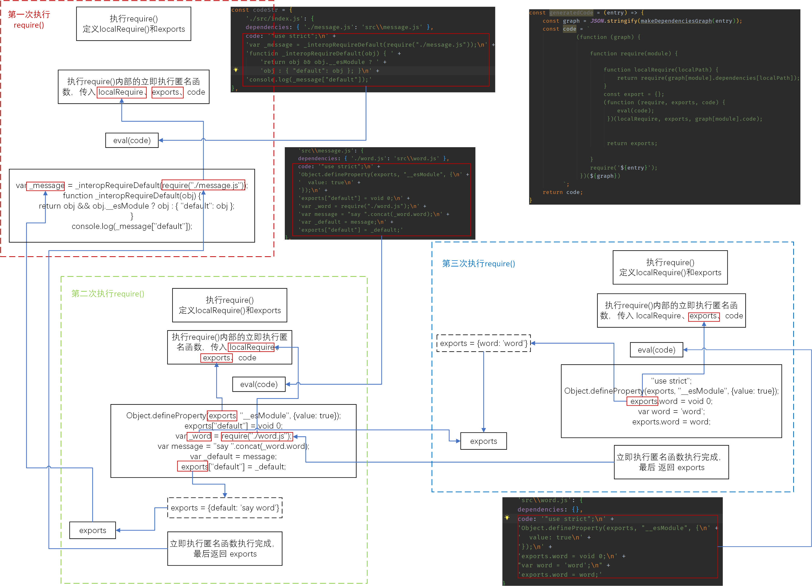

# 自定义 bundler

## 1. 分析依赖

1. 模块打包器的一个作用就是从入口文件开始，分析出每个模块与其他模块的一个依赖关系，得到依赖关系以后，再进行代码的编译。

2. 在 src 目录下，新建 `index.js`、`message.js` 和 `word.js` 这三个文件，内容如下：
   - `index.js`
     ```javascript
        import message from './message.js';
        console.log(message);
     ```
   - `message.js`
      ```javascript
         import {word} from './word.js';
         
         const message = `say ${word}`;
         
         export default message;
      ```
   - `word.js`
     ```javascript
        export const word = 'word';
     ```
3. `index.js` 引入了 `message.js`， `message.js` 引入了 `word.js`，简便起见，我们给每个导入的模块加了后缀。

4. 新建一个 `bundler.js`，这个 js 文件就是用来打包的。我们要在这个文件中完成三件事：
   - 分析依赖
   - 生成依赖图谱
   - 编译为浏览器可执行的代码

5. 首先进行的分析依赖。在 `bundler.js` 中，新建一个函数：`moduleAnalyser()`，内容如下：
   ```javascript
      const fs = require('fs');
      const path = require('path');
      const parser = require('@babel/parser');
   
      const traverse = require('@babel/traverse').default;
      // import traverse from '@babel/traverse';
   
      const babel = require('@babel/core');
   
      const moduleAnalyser = (filename) => {
         const content = fs.readFileSync(filename, 'utf-8');
   
         const ast = parser.parse(content, {
             sourceType: 'module',
         });
         const dependence = {};
         traverse(ast, {
             ImportDeclaration({node}) {
                 const dirname = path.dirname(filename);
                 
                 const newFile = path.join(dirname, node.source.value);
   
                 dependence[node.source.value] = newFile;
             }
         });
   
         const {code} = babel.transformFromAst(ast, null, {
             presets: ['@babel/preset-env']
         });
   
         return {
              filename,
              dependence,
              code
         }
         
      }
   ```

6. 使用 `fs.readFileSync()` 同步读取 `filename` 指定的文件内容，并指定了文件的编码为 `utf-8`。

7. 获取了 js 文件的源码后，我们需要分析出引入了哪些模块。所以我们能这里使用 `@babel/parser` 对 js 源码进行解析，将其转换为 AST （abstract syntax code）。
   - `@babel/parser` 是用来解析 js 代码的 babel 插件。
   - 安装：`npm install @babel/parser --save`
   - 我们使用 `parser()` 方法完成对 js 代码的解析。接收两个参数：
     - code：必填，字符串形式的 js 源代码
     - options：可选，配置项，我们这里的配置项是 `sourceType`，表示解析代码的模式。因为我们的源代码中使用了 ES Module 形式引入其他模块，所以 `sourceType` 设置为 `module`。还可以设置为 `script` 或者是 `unambiguous`。
       > Indicate the mode the code should be parsed in. Can be one of "script", "module", or "unambiguous". Defaults to "script". "unambiguous" will make @babel/parser attempt to guess, based on the presence of ES6 import or export statements. Files with ES6 imports and exports are considered "module" and are otherwise "script".
   - `@babel/parser` 详细的说明文档：[@babel/parser](https://babeljs.io/docs/en/babel-parser#docsNav)
   
8. 将 index.js 内的源码转换为 AST，部分内容被如下：
   

9. 在源码的 AST 中，我们需要获取 `ImportDeclaration` 这个节点，因为这个节点存放这我们导入的文件的相关信息。而 AST 实际上是一个大的对象，我们自己手动去遍历这个对象不方便，而且效率不高，因此我们使用另外一个 babel 插件 —— `@babel/traverse`，完成对 AST 的遍历。
   - `@babel/traverse`
   - 安装：`npm install @babel/traverse ---save`
   - 主要作用是将其与 babel 解析器一起使用来遍历和更新节点。
     - 对语法树中特定的节点进行操作(特殊节点的函数)
     - 进入节点（enter）
     - 退出节点（exit）
   - traverse() 是默认导出，所以使用 ES6 语法导入：`import traverse from "@babel/traverse";` 
   - 如果使用 CommonJS 方式导入，就需要导出 `default`，即 `const traverse = require('@babel/traverse').default;`
   - `@babel/traverse` 参考文档：[@babel/traverse](https://babeljs.io/docs/en/babel-traverse#docsNav)
   - traverse() 接收的第一个参数是 AST，第二个参数是配置项对象，我们可以在配置项中定义函数，函数名就是我们要获取的那个节点，函数接收的参数就是这个节点相关的内容，我们目前只需要节点中的 `node` 字段，所以直接从参数中取即可，示例如下所示：
     ```javascript
        traverse(ast, {
          CallExpression(p) {
            // 对语法树中特定的节点进行操作 参考@babel/types （特定节点类型）
            // CallExpression 特定节点
          },
          FunctionDeclaration: function(path) {
            // 对语法树中特定的节点进行操作 参考@babel/types （特定节点类型）
            // FunctionDeclaration 特定节点
          }
          // .....
        
          enter(path) {
            // 进入节点
            if (path.node.type === "ThisExpression") {
              // 对所有的操作
            };
          }
          exit(path) {
            // 退出节点
            console.log(`  exit ${path.type}(${path.key})`)
          }
        })
     ```
     我们在配置项中使用的是第一种获取节点的形式：
     ```javascript
        const traverse = require('@babel/traverse').default;
        traverse(ast, {
            // 节点名称
            ImportDeclaration({node}) {
                // do something with variable node
     
                const dirname = path.dirname(filename);
                                 
                const newFile = path.join(dirname, node.source.value);
                   
                dependence[node.source.value] = newFile;
            }
        });
     ```
   - `node.source.value` 这个值，实际上是我们导入模块的一个相对路径，由于这个路径是相对于当前的 js 文件而言的，所以我们需要将相对路径转换为绝对路径：`const newFile = path.join(dirname, node.source.value);`
   - path.dirname() 这个方法接收一个路径作为参数，返回这个路径的目录名称。例如，传入的路径是： `/foo/bar/baz/asdf/quux`，返回值是：`/foo/bar/baz/asdf`。
   - 因为可能用到相对路径，所以我们以模块的相对路径为 key，绝对路径为 value，生成一个对象：dependence。
   
10. 将 ES6 语法的代码生成 ES5 代码。这个是为了实现代码的一个兼容性，保证其在低版本浏览器也能运行。所以我们要使用 `@babel/core` 对代码进行转换。
    - transformFromAst() 这个方法接收一个 AST，并将其转换为 ES5 的代码。
    - `transformFromAst(ast: Object, code?: string, options?: Object, callback: Function): FileNode | null`
      - `ast`：抽象语法树
      - `code`：可选，源代码
      - `options`：可选，配置项
      - `callback`：可选，回调函数。
      - 返回值，如果设置了回调，则这个方法是异步方法，将转换后的代码相关的一个对象作为参数传入回调中。如果没有设置回调，则这个方法为同步方法，返回值就是转换后的代码相关的一个对象。
    - 在对代码进行转换的过程中，还需要使用 `@babel/preset-env` 这个 babel 推荐的预置插件集合，包含一系列的配置项，来设置代码转换，如 `target`、`useBuildIn` 等。所以，我们在 transformFromAst() 的配置项中直接配置一个 `presets` 即可。如下所示：
      ```javascript
         const {code} = babel.transformFromAst(ast, null, {
                      presets: ['@babel/preset-env']
         });
      ```
    - transformFromAst() 的返回值是一个对象，对象内部包含着转换后的代码等内容，我们这里只需要转换后的代码，所有从中取出 `code` 属性的内容。如上面的代码所示。
    - transformFromAst() 方法详细说明：[transformFromAst](https://babeljs.io/docs/en/babel-core#transformfromast)
    - `@babel/preset-env` 的相关内容：
       - [Babel7 中 @babel/preset-env 的使用](https://zhuanlan.zhihu.com/p/84799735)
       - [最近折腾 @babel/preset-env 的一些小心得](https://blog.meathill.com/js/some-tips-of-babel-preset-env-config.html)
       - [@babel/preset-env](https://babeljs.io/docs/en/babel-preset-env)

11. 拿到编译后的代码后，将 `code`（代码）、`dependence`（依赖）和 `filename`（入口文件）组合为一个对象，作为函数的返回值返回。

## 2. 生成依赖图谱 （dependence graph）

1. 基本的打包流程是：从入口文件开始，分析这个文件的依赖，然后再根据依赖，去分析这个依赖文件所依赖的其他依赖，以此类推，完成整个项目的 js 、css 等依赖关系。因此我们需要从入口文件开始，分析出模块之间的依赖关系。

2. 正常来说，我们应该使用递归的方式去分析依赖关系。但是递归比较复杂，所有，这里，我们使用可变长度的数组来实现递归的功能。

3. 示例代码：
   ```javascript
      const makedependenceGraph = (entry) => {
           const entryModule = moduleAnalyser(entry);
           const graphArray = [entryModule];
   
           for (let i = 0; i < graphArray.length; i++) {
               let item = graphArray[i];
               let {dependence} = item;
               if (dependence) {
                   for (let key in dependence) {
                       let path = dependence[key];
                       graphArray.push(moduleAnalyser(path));
                   }
               }
           }
   
           const graph = {};
           graphArray.forEach(item => {
               graph[item.filename] = {
                   code: item.code,
                   dependence: item.dependence
               }
           });
   
           return graph;
      }
   ```
4. 分析入口文件，得到分析结果：`entryModule`，将分析结果放入一个数组中：`graphArray`。

5. 遍历 `graphArray`，从数组项 `item` 中取出 `dependence`，`dependence` 是一个对象，存放的是某个模块的绝对路径。对象的 key 是相对路径，value 是绝对路径。所以我们使用 for...in 循环，遍历 `dependence` 对象，拿到模块的绝对路径，然后使用 moduleAnalyser() 方法，分析这个模块。将分析结果放到 `graphArray` 中。

6. 传统的 for 循环遍历数组，不要求数组的长度和内容是固定的，也就是每次循环结束，数组内容如果有变化，包括长度变化，那么下次循环时以当前的最新的数组为主。因此间接实现了递归的功能。

7. 对最终的存放模块分析结果的数组进行改造，将其转换为一个对象，以 `filename` 为 key，`code` 和 `dependence` 包装为对象，将其作为 `filename` 的 value。


## 3. 编译为浏览器可执行的代码

1. 使用 babel 提供的一些工具，完成了模块之间的依赖关系的分析以及代码的转换。现在我们需要将转换后的代码组合起来，生成一份浏览器可执行的代码。

2. 经过 babel 转换后的代码如下：
   - `index.js`
     ```javascript
        "use strict";
         var _message = _interopRequireDefault(require("./message.js"));
         function _interopRequireDefault(obj) { 
            return obj && obj.__esModule ? obj : { "default": obj }; 
         }
         console.log(_message["default"]);
     ```
   - `message.js`
     ```javascript
        "use strict";
        Object.defineProperty(exports, "__esModule", {value: true});
        exports["default"] = void 0;
        var _word = require("./word.js");
        var message = "say ".concat(_word.word);
        var _default = message;
        exports["default"] = _default;
     ```
   - `word.js`
     ```javascript
        "use strict";
        Object.defineProperty(exports, "__esModule", {value: true});
        exports.word = void 0;
        var word = 'word';
        exports.word = word;
     ```
3. 我们首先对这三段代码进行分析：
   - 这段代码是要放到浏览器中运行，因此，代码中出现的东西都应该是能够被浏览器识别的。
   - 代码中出现了 require() 函数和 exports 对象，这两个东西在浏览器环境下是没有的。因此我们需要自己在代码中定义 require() 函数和 exports 对象。
   - 我们需要生成一段可执行源码，源码是字符串格式的，可以写入到文件中。
   - 除了生成的源码，我们还需要每个模块的绝对路径。因为从上面的源码中可以看出，依赖的还是相对路径，但是相对路径还是拿不到文件，所以，我们还需要模块的绝对路径。

4. 生成源码
   ```javascript
      const generatedCode = (entry) => {
          const graph = JSON.stringify(makedependenceGraph(entry));
          const code = `
              (function (graph) {
                   
                  function require(module) {
   
                      function localRequire(localPath) {
                          return require(graph[module].dependence[localPath]);
                      }
                      const export = {};
                      (function (require, exports, code) {
                          eval(code);
                       })(localRequire, exports, graph[module].code);
                       
                       
                       return exports;
   
                  }
                  require('${entry}');
               })(${graph})
          `;
          return code; 
      }
   ```
5. 利用 makedependenceGraph() 生成依赖图谱：`graph`。因为要生成可执行的源码，而 `graph` 是作为参数传入的，因此要使用 JSON.stringify() 方法将 `graph` 对象转换为字符串。

6. `code` 存放的是源码信息。首先定义一个立即执行匿名函数，作用是避免污染浏览器的作用域。函数接收 `graph` 作为参数，因此我们需要将前面生成的 `graph` 对象传入。
   ```javascript
      `(function(graph) {...})(${graph})`
   ```

7. 因为在 `index.js`、`message.js` 和 `word.js` 中，有 require() 和 exports 对象，所以，我们要在匿名函数中，定义 require()，并进行调用。
   ```javascript
      `
        function require(module) {...}
        require('${entry}')
      `
   ```
   - require() 接收 `entry` 作为参数，调用时，直接传入前面的 `entry` 变量即可。
   - 注意，因为我们这里是生成 js 代码，而不是执行，所以要将 entry 转换字符串形式，即加上单引号。如果不加，就会成这样：`require(./src/index.js)`，显然不是字符串形式的路径，所以这里必须加上单引号。
   
8. require() 详解
   - require() 方法的源码：
     ```javascript
        require(module) {
     
            function localRequire(localPath) {
                return require(graph[module].dependence[localPath]);
            }
     
            var exports = {};
            (function(localRequire, exports, code) {
                eval(code);
            })(localRequire, exports, graph[module].code)             
            return exports;
        }
     ```
   - require() 函数的主要作用就是根据入口文件的绝对路径，去 `graph` 对象中寻找模块的源代码，找到源代码以后，使用 eval() 方法执行源代码。而模块的源代码又会调用 require()，所以就形成了递归调用。
   - localRequire() 详解：
     - `index.js` 的源码中，是这样调用 require() 的：`require("./message.js")`，传入的是 `message.js` 的相对路径。但实际上，require() 接收的是绝对路径，所以我们需要将相对路径转换为绝对路径。因此在 require() 中，定义一个 localRequire()，用于路径转换。接收 localPath，作为相对路径，`graph[module].dependence[localPath]` 这样拿到的是绝对路径，最后将转换后的绝对路径传入 require() 函数中并返回。
     - 由于是在闭包中执行，require() 指向的是形参 require，而源码中，require() 接收的是：`./message.js`，这是一个相对路径，我们知道，在 graph 对象中，我们是以模块的绝对路径为 key 的，想要拿到 `message.js` 的依赖和源码，就必须获得 `message.js` 的绝对路径，而 dependence 字段中，恰好是相对路径为 key，绝对路径为 value，这样就根据相对路径 `./message.js`，拿到绝对路径 `src/message.js`。
     - 前面说过，模块源码中的 require() 指向的是形参 `require`，而实际上，实参是 `localRequire`，这样就将 `./message.js` 传入 localRequire() 中，从而拿到了绝对路径。因此，这是一个递归调用。
     - 递归的出口就是源码内部不再引用 require()。
   - require() 的关键在于如何执行模块的源代码。所以我们在require() 内部定义了一个立即执行匿名函数，用来执行模块的源代码。这个闭包的目的是将 js 代码封装在一个单独的作用域执行，避免污染其他作用域的变量。这个匿名函数接收三个参数：
     - `localRequire` 
     - `exports`
     - `code` 模块元代码
   - `localRequire` 这个参数就是前面定义的 localRequire() 函数
   - `exports` 这个对象就是模块源代码中需要的 exports 对象，我们在 require() 中单独定义，并在require() 函数执行完毕后，将 exports 返回。以 `word.js` 中的源码为例：
     ```js
        "use strict";
        Object.defineProperty(exports, "__esModule", {value: true});
        exports.word = void 0;
        var word = 'word';
        exports.word = word;
     ```
     - `exports` 中被添加了 `word` 字段，待 require() 中的立即执行匿名函数执行完成后，`exports` 的内容是：`{word: 'word'}`，然后被返回。此时，在 `message.js` 的源码中调用了 require(),，如下所示：
     ```javascript
        Object.defineProperty(exports, "__esModule", {value: true});
        exports["default"] = void 0;
        var _word = require("./word.js");
        var message = "say ".concat(_word.word);
        var _default = message;
        exports["default"] = _default;
     ```
     - `_word` 接收了 require() 的返回值，则 `_word` 现在的内容是：`{word: 'word'}`。
     - 所以，在 `message.js` 源码执行完成后，`exports` 变量的内容是：`{default: 'say word'}`，并且向 `exports` 中添加了新的属性：`__esModule`。最后将这个 `exports` 返回。
     - 在 `index.js` 中，`require("./message.js")` 执行完成后，拿到的返回值就是上面的 `exports` 对象。
     ```javascript
        "use strict";
        var _message = _interopRequireDefault(require("./message.js"));
        function _interopRequireDefault(obj) { 
             return obj && obj.__esModule ? obj : { "default": obj }; 
        }
        console.log(_message["default"]);
     ```
     - `_message` 最终内容是：`{default: 'say word'}`。
   - 而 `code` 参数，则是根据 `module`（绝对路径） ，从 `graph` 对象中拿出 `code`（源代码）作为参数传入匿名函数中。
   - 最后调用 eval() 方法执行模块源代码。

## 4. 总结

1. 借助 babel 中的相关插件，完成对模块的依赖分析和代码的转换。

2. 利用 for 循环中数组长度可变的特性，将入口文件的依赖分析结果放入数组中，然后对数组进行遍历，根据入口文件的依赖，分析出新的依赖结果，存入数组中，以此类推，层层递进，这样间接地实现了递归分析模块间地依赖。

3. 生成源码的关键在于：
   - 多次使用立即执行匿名函数，避免作用域的污染。
   - require() 的正确实现。require() 函数实际上就是根据绝对路径，从依赖图谱中取出相应模块的源代码，并执行。
   - localRequire () 对于相对路径的转换，以及对与require() 的递归调用。
   - require() 的递归调用。
   - 定义函数过程中形参与实参的理解与应用。
   - 在使用递归的过程，必须存在返回值，同时注意递归的终止条件。
   
4. 递归执行 require() 如下图所示：
   