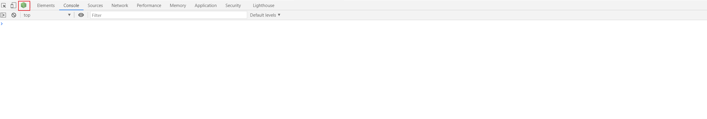
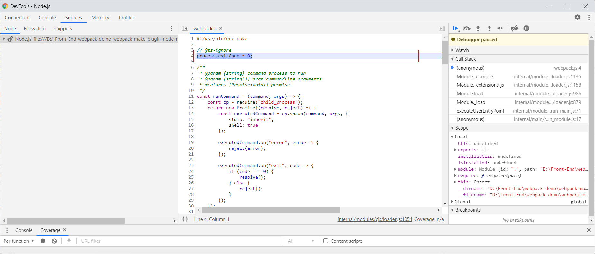
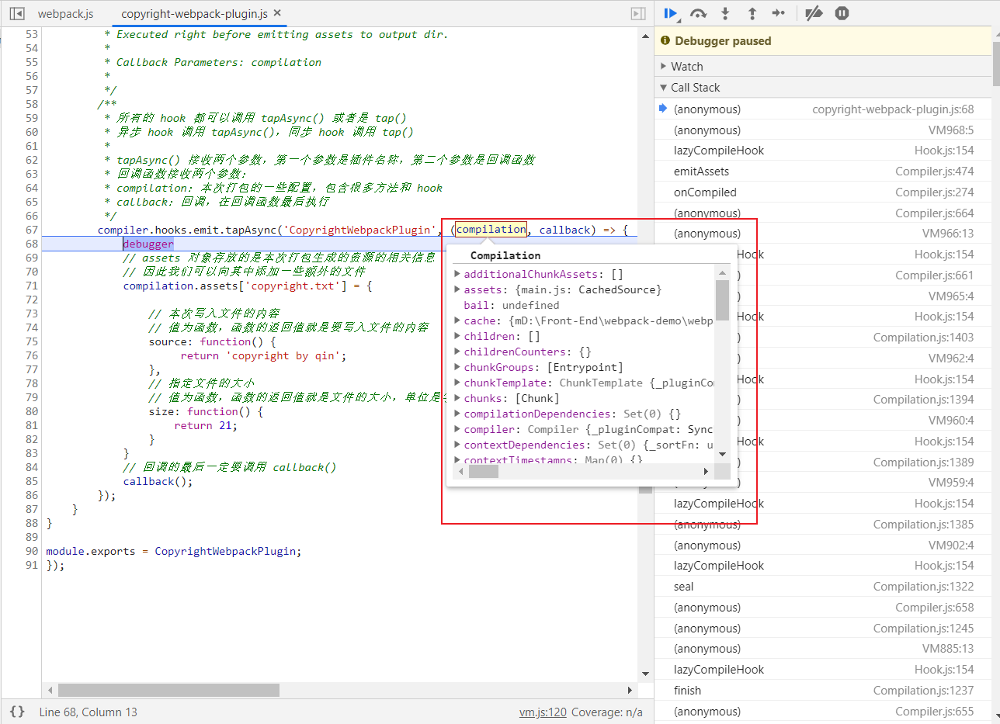

<!-- START doctoc generated TOC please keep comment here to allow auto update -->
<!-- DON'T EDIT THIS SECTION, INSTEAD RE-RUN doctoc TO UPDATE -->
**Table of Contents**  *generated with [DocToc](https://github.com/thlorenz/doctoc)*

- [自定义 plugin](#%E8%87%AA%E5%AE%9A%E4%B9%89-plugin)
  - [1. 背景](#1-%E8%83%8C%E6%99%AF)
  - [2. 书写自定义 plugin](#2-%E4%B9%A6%E5%86%99%E8%87%AA%E5%AE%9A%E4%B9%89-plugin)
  - [3. 使用 hooks](#3-%E4%BD%BF%E7%94%A8-hooks)
  - [4. 调试 plugin](#4-%E8%B0%83%E8%AF%95-plugin)
  - [5. 总结](#5-%E6%80%BB%E7%BB%93)

<!-- END doctoc generated TOC please keep comment here to allow auto update -->

# 自定义 plugin

## 1. 背景

1. 在 webpack 中，插件就是在 webpack 运行到某个时机，对打包编译过程进行某种操作的工具。

2. 插件是一个构造函数或者类，能够使用 `new` 关键字进行实例化。

3. webpack 提供了很多的 hook，这些 hook 在打包编译过程中的不同时机被触发，类似于 React 中的组件的生命周期函数。

4. 参考资料：
   - [compiler-hooks](https://webpack.js.org/api/compiler-hooks/)
   - [Plugin API](https://webpack.js.org/api/plugins/)
   - [Writing a Plugin](https://webpack.js.org/contribute/writing-a-plugin/)


## 2. 书写自定义 plugin

1. 在项目根目录西，新建一个文件夹叫做：`plugins`。在 `plugins` 新建一个文件：`copyright-webpack-plugin.js`。这个 js 文件就是我们要写的插件，作用是生成一个版权文件，在打包结束后，放到 dist 目录下。内容如下：
   ```javascript
      // copyright-webpack-plugin.js
      class CopyrightWebpackPlugin {
          constructor(options) {}
 
          apply(compiler) {}
      }
      
      module.exports = CopyrightWebpackPlugin;
   ```
   这就是一个 webpack 插件的基本结构:
   - 必须是构造方法或者类
   - 类中必须覆写 apply() 方法

2. 使用自定义 plugin。先导入这个插件，然后在 `plugins` 字段中进行配置。如下所示：
   ```javascript
      // webpack.config.js
   const CopyrightWebpackPlugin = require('./plugins/copyright-webpack-plugin');
      module.exports = {
         plugins: [
             new CopyrightWebpackPlugin()
         ],
      }
   ```

3. 给自定义组件传 options
   - 自定义组件的配置项 options 主要是通过构造函数传递，形式如下：
     ```javascript
        // webpack.config.js
           const CopyrightWebpackPlugin = require('./plugins/copyright-webpack-plugin');
              module.exports = {
                 plugins: [
                     new CopyrightWebpackPlugin({
                         name: 'rose'
                     })
                 ],
              }
     ``` 
   - 我们只需要在定义自定义 plugin 的时候，在构造方法中设置参数即可。如下所示：
     ```javascript
        // copyright-webpack-plugin.js
        class CopyrightWebpackPlugin {
            constructor(options) {
                // {name: "rose"}
                console.log(options);
            }
         
            apply(compiler) {}
        }
     ```
     这样就可拿到外界传入的配置项，根据配置项进行更精细的操作。

## 3. 使用 hooks

1. plugin 中的 apply() 方法，才是我们真正进行操作的地方。

2. apply() 接收一个 compiler 参数。compiler 可以理解为 webpack 实例，包含了 webpack.config.js 中的配置项，扩展了 Tapable 类，目的是注册和调用 plugin。

3. 我们需要 用到 compiler 中的内容是 hooks。我们可以去官网查看 webpack 提供了哪些 hook。这里举一个例子：
   - hook 名称：`emit`
   - 同步/异步：`AsyncSeriesHook` 异步调用
   - hook 调用时机：`Executed right before emitting assets to output dir` 触发时机是在将打包后的资源写入到输出目录之前
   
4. 我们使用 `emit` 这个 hook 的完成我们的需求。示例如下：
   ```javascript
      class CopyrightWebpackPlugin {
          apply(compiler) {
              compiler.hooks.emit.tapAsync('CopyrightWebpackPlugin', (compilation, callback) => {
                  // assets 对象存放的是本次打包生成的资源的相关信息
                  // 因此我们可以向其中添加一些额外的文件
                  compilation.assets['copyright.txt'] = {  
                       source: function() {
                           return 'copyright by qin';
                       },
                              
                       size: function() {
                           return 21;
                       }
                  };
                  // 回调的最后一定要调用 callback()
                  callback();
              });
          }
      }
   ```
5. 说明：
   - 所有的 hook 都可以调用 tapAsync() 或者是 tap()
   - 异步 hook 调用 tapAsync()，同步 hook 调用 tap()。同步还是异步官网上有说明。
   - tapAsync() 接收两个参数，第一个参数是插件名称，第二个参数是回调函数
     - 回调函数接收两个参数：
     - compilation：本次打包的一些配置，包含很多方法和 hook
     - callback：回调，在 tapAsync() 的回调函数最后执行

6. 我们想在 hook 被触发时做一些事，就是借助 compilation 中的一些属性或者方法完成的，因此需要很了解 compilation 的组成。例如上面的示例中，`assets` 包括了本次打包生成的文件所有信息，因此，我们可以通过向 `assets` 中添加额外的文件信息，将新的文件输出到 dist 目录中：
   ```javascript
      compilation.assets['copyright.txt'] = {  
           
           // 本次写入文件的内容
           // 值为函数，函数的返回值就是要写入文件的内容
           source: function() {
               return 'copyright by qin';
           },
           
           // 指定文件的大小
           // 值为函数，函数的返回值就是文件的大小，单位是字节                   
           size: function() {
               return 21;
           }
      };
   ```
7. 再来一个同步 hook 的例子：
   - hook 名称：`compile`
   - 同步/异步：`SyncHook`同步 hook
   - 触发时机：`Called right after beforeCompile, before a new compilation is created.` 在一个新的 compilation 创建之前，在 beforeCompiler 调用之后触发。
   - 调用同步的 compiler 的示例代码如下：
     ```javascript
        compiler.hooks.compile.tap('CopyrightWebpackPlugin', (compilation) => {
             console.log('compiler');
        })
     ```
8. 说明：
   - 同步 hook 调用的是 tap()
   - tap() 方法接收两个参数，第一个参数是插件名称，第二个参数是回调函数
   - 回调函数只接收一个参数：
     - compilation：本次打包的一些配置

## 4. 调试 plugin

1. 我们必须借助 compilation 的内容才能实现我们想要的一些功能，那么怎么能了解 compilation 包含哪些东西呢，使用 console.log() 打印出来不够直观，而且也没法了解具体的属性。所以我们可以借助 node 的调试命令结合chrome 浏览器实现对插件的调试。

2. 我们使用 node 的调试工具。在 package.json 中 `script` 字段中添加下面的内容：
   ```json
      {
          "scripts": {
              "debug": "node --inspect --inspect-brk node_modules/webpack/bin/webpack.js"
          }  
      }
   ```
   命令参数解释：
   - `--inspect` 开启 node 的调试工具
   - `--inspect-brk` 在被 node 执行的这个文件的第一行打一个断点
   
3. 执行 `npm run debug` 后，node 的调试环境就被启动了。然后启动 chrome 浏览器，按下 f12，进入开发者页面，选择：`console`，如下图所示：
   

4. 点击 node 图标，就进入了 chrome 的 DevTools - Node.js 界面，如下图所示：
   
   从图中可以看出，断点在 webpack.js 的第一行代码那里。
   
5. 这样就可以在自定义 plugin 中使用 debugger 打断点，进行调试了。
   

6. node 调试的官方文档：[Debugging Guide](https://nodejs.org/en/docs/guides/debugging-getting-started/)
## 5. 总结

1. 自定义 plugin 必须是一个类或者构造函数。

2. 配置项通过构造方法接收。

3. 必须覆写 apply() 方法。

4. 借助 hook 在 webpack 打包的不同时刻进行操作。

5. hook 有同步异步之分，要注意同步 hook 与异步 hook 的用法的区别。

6. 要想写出比较好的 plugin，需要我们深入了解 webpack 的源码和实现过程。